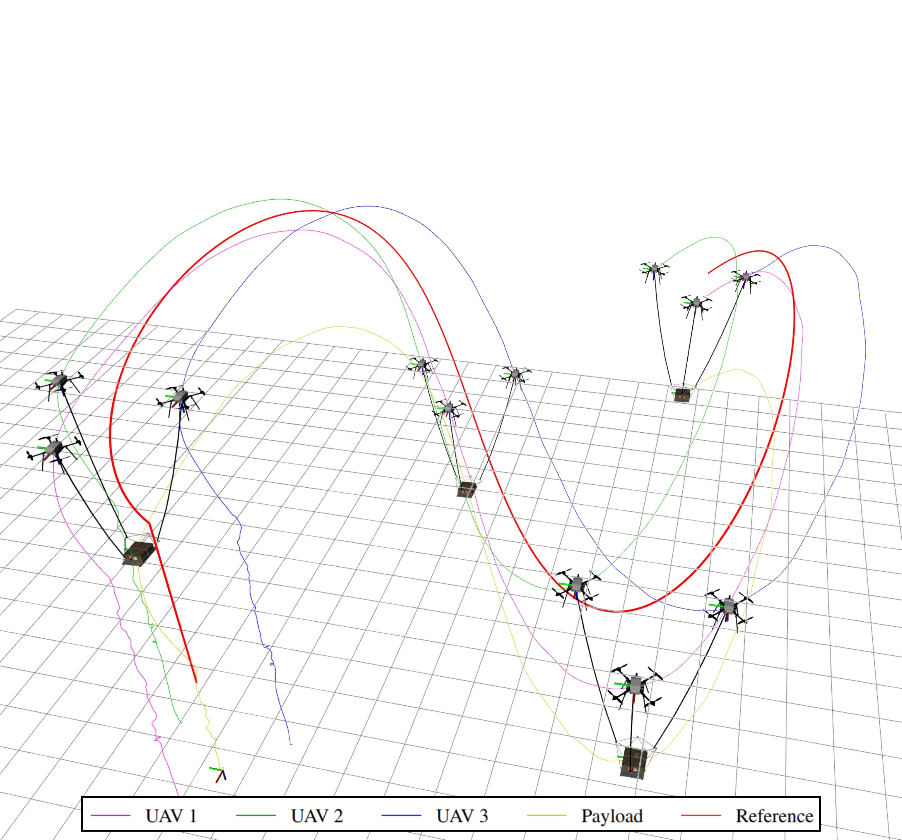
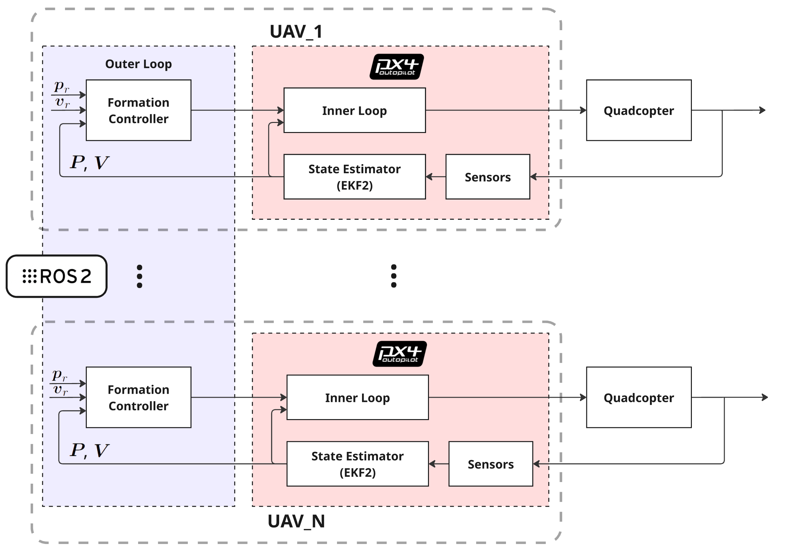

# Cooperative Slung-Load UAV Software Architecture
A ROS 2 and PX4-based distributed software framework designed for cooperative cable-suspended payload transportation using multi-rotor UAV formations. This project provides a full-stack solution encompassing physical simulation, distributed swarm communication middleware, high-level formation control, and multi-agent validation pipelines in both Software-In-The-Loop (SITL) and Hardware-In-The-Loop (HITL) environments.

Developed at Sapienza University of Rome (Department of Aerospace and Mechanical Engineering).



# Key System Features

- Custom Physics Simulator
  Real-time dynamic simulation integrated with PX4 Autopilot for SITL & HITL validation. Supports multi-instance quadcopter flights and cooperative slung-load configurations via multibody dynamics.

- Decentralized Formation Strategy:
  Computes distributed optimal control laws locally on each UAV, eliminating single-point-of-failure architectures while tracking global reference trajectories.

- Hierarchical Nested-Loop Control:
  Decouples fleet-level cooperative maneuvers (outer loop) from individual flight stabilization (inner loop), guaranteeing system-wide stability during complex tasks.

- ROS2 & DDS-Native Execution:
  Leverages ROS2's distributed DDS middleware for modular, peer-to-peer inter-agent communication, treating each quadrotor as an autonomous computational node.



# Useful Resources
- [ROS2 Documentation](https://docs.ros.org/en/humble/index.html)
- [PX4 Autopilot Documentation](https://docs.px4.io/main/en/)
- [SeeedStudio NVidia Jetson reComputer j4012 Documentation](https://wiki.seeedstudio.com/reComputer_Industrial_Getting_Started/)
- Jetpack 6.0 (Ubuntu 22.04) for reComputer j4012 system Image [Download](https://seeedstudio88-my.sharepoint.com/:u:/g/personal/youjiang_yu_seeedstudio88_onmicrosoft_com/EbKZo6jvhR5MtP5hSB2mWIUBLkMB_pl4zCJoGhAbao5yQw?e=WmoPbO)

## Prerequisites

- **OS:** Ubuntu 22.04 LTS (Jammy Jellyfish)
- **ROS 2:** Humble Hawksbill
- **Autopilot:** PX4 Autopilot (v1.17.0)

## Installation & Setup

### ROS 2 Installation
Follow the official ROS 2 Humble installation guide to install Debian packages:
- [ROS 2 Humble Ubuntu Install Guide](https://docs.ros.org/en/humble/Installation/Ubuntu-Install-Debs.html)

After installation, source the setup file in your `.bashrc`:

```bash
echo "source /opt/ros/humble/setup.bash" >> ~/.bashrc
source ~/.bashrc
```

### PX4 Autopilot Installation
Use as reference the [official ROS2 PX4 installation & setup](https://docs.px4.io/main/en/ros2/user_guide)
Clone the PX4 official repo:
```bash
cd
git clone [https://github.com/PX4/PX4-Autopilot.git](https://github.com/CooperativeSwarmStack/PX4-Autopilot.git) --recursive
```
Checkout with version 1.17.0:
```bash
cd ~/PX4-Autopilot
git checkout v1.17.0
```
Resolve PX4 required dependencies:
```bash
bash ./PX4-Autopilot/Tools/setup/ubuntu.sh
```
Build a developer instance:
```bash
cd PX4-Autopilot/
make px4_sitl
```
### ROS2 Workspace setup
Best practice is to create a new directory for every new workspace. The name doesn’t matter, but it is helpful to have it indicate the purpose of the workspace.
Let’s choose the directory name ```swarm_ws```:
```bash
mkdir -p ~/swarm_ws/src
cd ~/swarm_ws/src
```
Clone all swarm ROS2 packages:
```bash
git clone https://github.com/CooperativeSwarmStack/flight_manager.git
git clone https://github.com/CooperativeSwarmStack/simulator.git
git clone https://github.com/CooperativeSwarmStack/formation_controller.git
git clone https://github.com/CooperativeSwarmStack/swarm_guidance.git
git clone https://github.com/CooperativeSwarmStack/swarm_interfaces.git
git clone https://github.com/PX4/px4_msgs.git
git clone https://github.com/RoverRobotics-forks/serial-ros2.git
```
Checkout ```px4_msgs``` package for PX4-Autopilot version, this is important to align PX4 messages between the Autopilot and uXRCE-DDS:
```bash
cd ~/swarm_ws/src/px4_msgs
git checkout v1.17.0
```
Use ```rosdep``` to check package dependencies:
```bash
cd ~/swarm_ws
rosdep update #to ensure rosdep has the latest package index
rosdep install --from-paths src --ignore-src -s
rosdep install --from-paths src --ignore-src -y
```
To build ROS 2 packages inside the `swarm_ws` workspace, use `colcon`.

> [!NOTE]
> If `colcon` is not installed on your system, you can install it with:
> ```bash
> sudo apt update && sudo apt install -y python3-colcon-common-extensions
> ```

```bash
cd ~/swarm_ws
colcon build --symlink-install
```
To use ```swarm_ws``` as ROS2 workspace you have to source the workspace setup file in your `.bashrc`
```bash
echo "source ~/swarm_ws/install/setup.bash" >> ~/.bashrc
source ~/.bashrc
```
### uXRCE-DDS Agent Installation
This package can be installed as a ROS2 package inside the ws or a standalone from source.
#### A - Build in ROS2 workspace
```bash
cd ~/swarm_ws/src/
git clone -b v2.4.2 https://github.com/eProsima/Micro-XRCE-DDS-Agent.git
```
re-build the ROS2 workspace
```bash
cd ~/swarm_ws
colcon build
```
#### B - Install Standalone from Source
On Ubuntu you can build from source and install the Agent standalone using the following commands (DDS v2):
```bash
git clone -b v2.4.3 https://github.com/eProsima/Micro-XRCE-DDS-Agent.git
cd Micro-XRCE-DDS-Agent
mkdir build
cd build
cmake ..
make
sudo make install
sudo ldconfig /usr/local/lib/
```
<!--

**Here are some ideas to get you started:**

🙋‍♀️ A short introduction - what is your organization all about?
🌈 Contribution guidelines - how can the community get involved?
👩‍💻 Useful resources - where can the community find your docs? Is there anything else the community should know?
🍿 Fun facts - what does your team eat for breakfast?
🧙 Remember, you can do mighty things with the power of [Markdown](https://docs.github.com/github/writing-on-github/getting-started-with-writing-and-formatting-on-github/basic-writing-and-formatting-syntax)
-->
